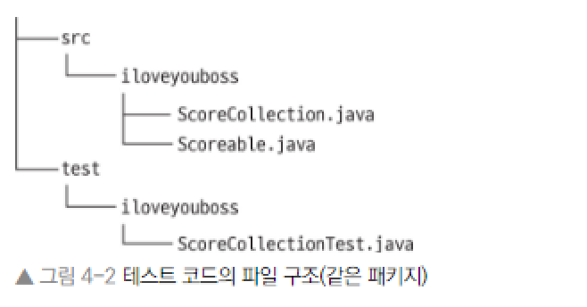

# Chapter 4. 테스트 조직

* 준비-실행-단언을 사용하여 테스트를 가시적이고 일관성 있게 만드는 방법
* 메서드를 테스트 하는 것이 아니라 동작을 테스트하여 테스트 코드의 유지 보수성을 높이는 방법
* 테스트 이름의 중요성
* @Before와 @After 애너테이션을 활용하여 공통 초기화 및 정리 코드를 설정하는 방법
* 거슬리는 테스트를 안전하게 무시하는 방법

## 4.1 AAA로 테스트 일관성 유지

* 준비\(Arrange\) : 테스트 코드를 실행하기 전에 시스템이 적절한 상태에 있는지 확인 \( 객체생성, API호출 등 \)
* 실행\(Act\) : 테스트 코드 실행 \( 보통 단일 메서드 호출 \)
* 단언\(Assert\) : 실행한 코드가 기대한 대로 동작하는지 확인
* 사후\(After\) : 테스트를 실행할 때 어떤 자원을 할당했다면 잘 정리되었는지 확인

## 4.2 동작 테스트 vs 메서드 테스트

* 단위 테스트를 작성할 때는 먼저 전체적인 시각에서 시작해야함. \( 개별 매서드를 테스트하는것이 아니라 종합적인 동작을 테스트 해야한다 \)

EX \) 은행의 ATM 클래스

deposit\(\), withdraw\(\), getValance\(\) 모두를 테스트 하기 위해서는 getBalance\(\) 메서드를 호출 해야함.

getBalance\(\) 메소드만 테스트하는것은 불필요 &gt; 입금과 출금 같은 다른 동작이 필요

## 4.3 테스트와 프로덕션 코드의 관계

### 4.3.1 테스트와 프로덕션 코드 분리

* 테스트 포함하면 JAR 파일이 부풀어짐\(약간의 성능 저하\)
* 코드 베이스의 공격 표면이 늘어남
* 세가지의 선택지 존재
* 테스트를 프로덕션 코드와 같은 디렉터리 및 패키지에 넣기 \( 배포 시 걷어 내는 스크립트 필요 \)
* 테스트를 별도 디렉터리로 분리하지만 프로덕션 코드와 같은 패키지에 넣기 \( 이클립스와 메이븐 같은 도구는 이 모델을 권장 \)
* 테스트를 별도의 디렉터리와 유사한 패키지에 유지하기




### 4.3.2 내부 데이터 노출 vs 내부 동작 노출

1. 테스트를 작성할 때 프로덕션 코드의 공개 인터페이스만 사용해야 한다고 믿음 -&gt; 공개가 아닌 메서드를 테스트 코드에서 호출하면 정보 은닉 원칙을 위배 한다고 생각 \( 비공개 코드를 호출하는 테스트는 그 자체로 구현 세부 사항과 결속 \)
2. 내부의 세부 사항을 테스트하는 것은 저품질로 이어질 수도 있음 -&gt; 코드의 작은 변화가 수많은 테스트를 깨면 깨진 테스트를 고치면서 당황 \( 강한 결합성 때문에 단위 테스트에 시간 투자하는 것을 거부하는 팀들도 존재 \)
3. 테스트가 프로덕션 코드와 같은 패키지에 있다면 게터 메서드를 호출하여 패키지 수준의 접근 권한을 얻을 수 있음.
4. 내부 데이터를 노출하는 것은 테스트와 프로덕션 코드 사이에 과도한 결합을 초래
5. 내부 행위를 테스트하려는 충동이 든다면 설계 문제 


단일 책임 원칙 \(SRP, Single Responsibility Principle \)

어떤 클래스가 작고 단일 목적을 가져야 함을 의미하며, 가장 좋은 해결책은 흥미로운 private 메소드를 추출하여 다른 클래스로 이동 &gt; 클래스의 유용한 public 메서드가 됨.


## 4.4 집중적인 단일 목적 테스트의 가치

```java
@Test
public void matches() {
   Profile profile = new Profile("Bull Hockey, Inc.");
   Question question = new BooleanQuestion(1, "Got milk?");

   // must-match 항목이 맞지 않으면 false
   profile.add(new Answer(question, Bool.FALSE));      
   Criteria criteria = new Criteria();
   criteria.add(
         new Criterion(new Answer(question, Bool.TRUE), Weight.MustMatch));

   assertFalse(profile.matches(criteria));

   // don't care 항목에 대해서는 true
   profile.add(new Answer(question, Bool.FALSE));      
   criteria = new Criteria();
   criteria.add(
         new Criterion(new Answer(question, Bool.TRUE), Weight.DontCare));

   assertTrue(profile.matches(criteria));
}
```

matches 메서드에 넣을 수 있으나, JUnit이 제공하는 테스트 고립의 중요한 이점을 잃게 됨.

&lt; 테스트 분리 &gt;

* 단언이 실패했을 때 실패한 테스트 이름이 표시되기 때문에 어느 동작에서 문제가 있는지 빠르게 파악
* 실패한 테스트를 해독하는 데 필요한 시간 단축 \(JUnit은 각 테스트를 변도의 인스턴스로 실행\)
* 모든 케이스가 실행되었음을 보장. 단언이 실패하면 현재 테스트 메서드를 중단함.\(java.lang.AssertionError\). 단언 실패 이후의 테스트 케이스는 실행되지 않음.

## 4.5 문서로서의 테스트

* 4.5.1 일관성 있는 이름으로 테스트 문서화
* doingSomeOperationGeneratesSomeResult \( 어떤 동작을 하면 어떤 결과가 나온다 \)
* someResultOccursUnderSomeCondition \( 어떤 결과는 어떤 조건에서 발생한다. \)
* givenSomeContextWhenDoingSomeBehaviorThenSomeResultOccurs \( 주어진 조건에서 어떤 일을 하면 어떤 결과가 나온다. \)
* whenDoingSomeBehaviorThenSomeResultOccurs \( 어떤 일을 하면 어떤 결과가 나온다. \)

-&gt; 한글 메소드로 만들면 한국에서는 알기 쉽고 편할듯

* 4.5.2 테스트를 의미 있게 만들기 \( 주석 뿐만 아니라 이름 개선 \)
* 지역 변수 이름 개선
* 의미 있는 상수 도입
* 햄크레스트 단언 사용
* 커다란 테스트를 작게 나누어 집중적인 테스트 만들기
* 테스트 군더더기들을 도우미 메서드와 @Before 메서드로 이동하기

## 4.6 @Before와 @After \(공통 초기화와 정리\) 더 알기

* @Before 메서드는 매번 테스트 매서드 실행에 앞서 실행됨.
* @Before 매서드로 결합하기 보다는 @Before 메서드를 여러개로 분할 \( 단, 다수의 @Before 사용시 순서가 보장되지 않으므로, 단일 @Before 매서드로 결합하여 순서대로 실행하도록 해야함 \)
* @After 매서드는 클래스에 있는 각 테스트를 한 후에 실행, 테스트가 실패해도 동작함 \( ex. 데이터베이스 연결 종료 \)
* @BeforeClass, AfterClass 애너테이션

```java
public class AssertMoreTest {
   @BeforeClass
   public static void initializeSomethingReallyExpensive() {
      // ...
   }

   @AfterClass
   public static void cleanUpSomethingReallyExpensive() {
      // ...
   }

   @Before
   public void createAccount() {
      // ...
   }

   @After
   public void closeConnections() {
      // ...
   }

   @Test
   public void depositIncreasesBalance() {
      // ...
   }

   @Test
   public void hasPositiveBalance() {
      // ...
   }
}
```

AssertMoreTest 클래스를 JUnit으로 실행한 흐름

@BeforeClass initializeSomethingReallyExpensive

@Before createAccount

@Test depositIncreasesBalance

@After closeConncetions

@Before createAccount

@Test hasPositiveBalance

@After closeConncetions

@AfterClass cleanUpSomethingReallyExpensive

## 4.7 녹색이 좋다: 테스트를 의미 있게 유지

* 4.7.1 테스트를 빠르게
  1. 필요하다고 생각하는 테스트만 실행 \( 피드백을 받지 않는 기간이 길어지면 애플리케이션에서 어떤 부분을 깨뜨리는 코드를 작성할 확률이 늘어남. \)
  2. 데이터베이스처럼 느린 자원을 통제하는 부분이 없다면 수초 안에 수천 개의 테스트를 실행

     하는것이 가능 \( 목 객체 활용 \)

  3. 외부 자원에 접근하는 테스트가 많아진다면 느려짐 \( JUnit은 Categories 기능 제공 \)
* 4.7.2 테스트 제외 \( @Ignore 애너테이션 사용 \)
  1. 문제가 있는 테스트에 집중하고 다른 실패 테스트는 주석 처리 \( 주석보다 나은 메커니즘 제공 \)

```java
@Test
@Ignore("dont't forget me!")
public void somethingWeCannotHandleRightNow() {
    // ...
}
```

